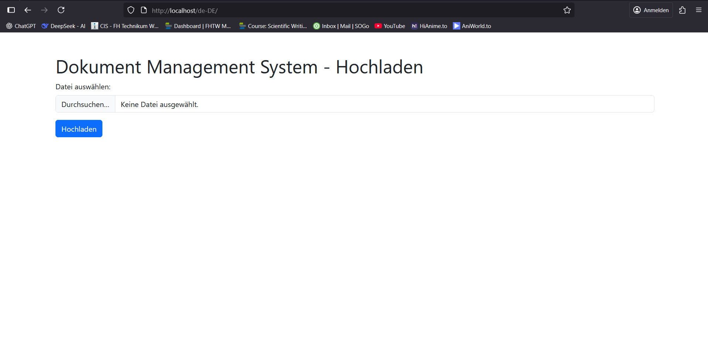

# Document Management System

## Project Overview

This is a Document Management System (DMS) for archiving documents in a FileStore. It includes features like automatic OCR (via a queue), automatic summary generation using Gen-AI, tagging, and full-text search with ElasticSearch. The project is built using C# in Visual Studio, following a sprint-based development approach.

The system uses a layered architecture:
- **DMS.Domain**: Core entities and business models.
- **DMS.DAL**: Data Access Layer with repositories and EF Core for ORM.
- **DMS.API**: REST API server for endpoints.
- **DMS.Tests**: Unit tests using xUnit.

Tech stack: .NET 8.0, Entity Framework Core, PostgreSQL (via Docker), Docker Compose.

## Sprint 1: Project Setup, REST API, DAL (with Mapping)
Sprint 1 focuses on setting up the project foundation, including the remote GitHub repository, creating a REST server (code-first), integrating ORM for persisting entities to PostgreSQL using the repository pattern, adding unit tests (mocking the production database), and setting up an initial `docker-compose.yml` for running the REST server and database in containers.

### Completed Tasks
1. **C# Project Setup**: Created a blank solution in Visual Studio 2022 with layered projects (API, Domain, DAL, Tests).
2. **Remote Repository Setup**: GitHub repo initialized, all team members can commit/push. Repo is private.
3. **REST Server Created**: Code-first endpoints for CRUD operations on documents (using ASP.NET Core Web API).
4. **ORM Integration**: Entity Framework Core used to persist entities to PostgreSQL. Repository pattern implemented for data access. Show correct function with unit-tests, mock out the "production" database.
5. **Unit Tests**: Full coverage for repository methods (Add, GetById, GetAll, Update, Delete) using InMemoryDatabase for mocking.
6. **Initial Docker Compose**: `docker-compose.yml` to run the API and PostgreSQL database in containers.

### Project Structure
```
DocumentManagementSystem/
├── DMS.API/                  # REST API layer (controllers, startup config)
│   ├── Controllers/          # API endpoints (e.g., DocumentsController.cs)
│   ├── Program.cs            # Entry point
│   ├── appsettings.json      # Configuration
│   └── DMS.API.csproj
├── DMS.Domain/               # Core entities and models
│   ├── Entities/             # Database entities (e.g., Document.cs)
│   └── DMS.Domain.csproj
├── DMS.DAL/                  # Data Access Layer
│   ├── Repositories/         # Repository interfaces and implementations (e.g., IDocumentRepository.cs, DocumentRepository.cs)
│   ├── ApplicationDbContext.cs  # EF Core DbContext
│   └── DMS.DAL.csproj
├── DMS.Tests/                # Unit tests
│   ├── DocumentRepositoryTests.cs  # Tests for repository methods
│   └── DMS.Tests.csproj
├── docker-compose.yml        # For running API and DB in containers
├── Dockerfile                # In DMS.API for building the API image
├── README.md                 # This file
├── .gitignore                # Ignores bin/obj, etc.
└── DocumentManagementSystem.sln  # Solution file
```

### Prerequisites
- Visual Studio with .NET 8.0 SDK.
- Docker Desktop installed and running.
- Git installed.

### Setup Instructions
1. **Clone the Repository**:
   ```
   git clone https://github.com/AkyolEmre/SWEN3-BIF-5L4-GF.git
   ```
   Open the solution (`DocumentManagementSystem.sln`) in Visual Studio.

2. **Restore NuGet Packages**:
   Right-click the solution in Solution Explorer > Restore NuGet Packages.

3. **Database Migrations** (Optional for Local Dev):
   - Install EF Core Tools if needed: `dotnet tool install --global dotnet-ef`.
   - In Package Manager Console (select DMS.DAL as default project):
     ```
     Add-Migration InitialCreate
     Update-Database
     ```
     Note: For Docker, migrations are applied automatically or manually via container.

5. **Run with Docker**:
   - From the solution root, run:
     ```
     docker-compose up --build
     ```
   - API: `http://localhost:8081` (Swagger at `/swagger`).
   - PostgreSQL: `localhost:5432` (user: postgres, pw: yourpassword, db: dmsdb).
   - Access DB via pgAdmin or similar tool.

### API Endpoints (Sprint 1)
- **GET /api/documents**: Get all documents.
- **GET /api/documents/{id}**: Get document by ID.
- **POST /api/documents**: Add a new document (JSON body).
- **PUT /api/documents/{id}**: Update a document (JSON body).
- **DELETE /api/documents/{id}**: Delete a document.

Example POST body:
```json
{
  "fileName": "example.pdf",
  "contentType": "application/pdf",
  "data": "base64encodeddatahere",
  "uploadedAt": "2025-10-14T00:00:00Z"
}
```

### Running Tests
- Open Test Explorer (View > Test Explorer).
- Build the solution.
- Run All Tests. All should pass (covers repository CRUD with InMemory mocking).
- 

# Sprint 2: Implement (Web-)UI with Webserver

## Sprint-Ziel
In diesem Sprint wurde eine einfache Web-UI implementiert, die über einen Nginx-Webserver in einem separaten Docker-Container serviert wird. Die UI kommuniziert mit dem REST-API-Backend aus Sprint 1 (z. B. zum Hochladen von Dokumenten). Als Basis wurde eine statische HTML-Seite verwendet, die eine Upload-Funktion bietet. Die UI ist minimalistisch und verwendet Bootstrap für das Styling. Der Fokus lag auf der Integration in Docker und der Proxy-Konfiguration via Nginx, um API-Aufrufe weiterzuleiten.

## Wichtige Änderungen am Projekt
- **Neue Dateien/Ordner**:
  - `index.html`: Eine statische HTML-Seite für die UI (Upload-Formular, das an `/api/Documents/Upload` postet).
  - `nginx.conf`: Konfigurationsdatei für Nginx (serviert statische Dateien und proxyt API-Anfragen).
  - `ui-static/` (oder ähnlicher Ordner): Ordner für statische UI-Dateien (z. B. index.html), der als Volume in Docker gemountet wird.
- **Updates an bestehenden Dateien**:
  - `docker-compose.yml`: Neuer Service `frontend` hinzugefügt (basierend auf `nginx:alpine`), mit Volumes für UI-Dateien und Nginx-Config. Ports: 80:80. Depends on `api`.
  - `DMS.API/Controllers/DocumentsController.cs`: Neuer Endpoint `[HttpPost("Upload")]` für Datei-Uploads hinzugefügt, der Dateien in die DB speichert.
- **Projektstruktur-Erweiterung** (in GitHub):
  ```
  DocumentManagementSystem/
  ├── ui-static/                # Statische UI-Dateien (z. B. index.html)
  ├── nginx.conf                # Nginx-Konfiguration
  ├── docker-compose.yml        # Erweitert um frontend-Service
  ... (bestehende Ordner aus Sprint 1)
  ```

## Voraussetzungen
- Visual Studio 2022 mit .NET 8.0.
- Docker Desktop installiert und laufend.
- PostgreSQL-Container aus Sprint 1 (via docker-compose).

## Ausführung und Deployment
1. Baue und starte die Container:
   ```
   docker-compose build
   docker-compose up -d
   ```
2. Zugriff auf die UI: Öffne im Browser `http://localhost` (Port 80).
3. Testen:
   - Lade eine Datei hoch – sie sollte im Backend (DB) gespeichert werden.
   - Überprüfe Logs: `docker-compose logs frontend`.
4. Stoppen: `docker-compose down`.

## UI Übersicht
Die UI ist eine einfache statische Seite mit einem Upload-Formular (Dateiauswahl und "Hochladen"-Button). Sie sieht so aus:  


### Contributors
- Team Members: Akyol Emre & Chauhan Harmanpreet
